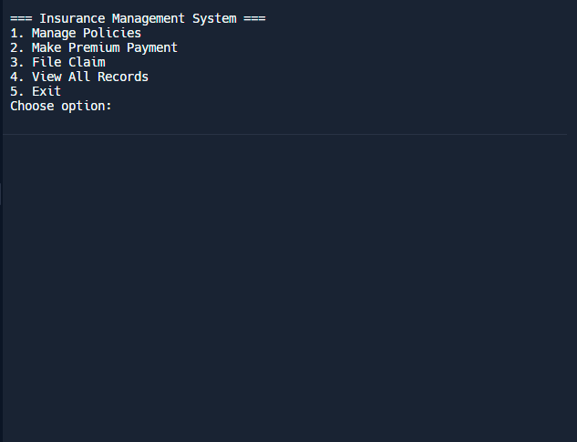

# Insurance Management System

A Java-based application for managing insurance policies, premium payments, and claims.




## Features

- Policy Management
  - Create new insurance policies
  - Track policy details including coverage and premium amounts
  - View policy status

- Premium Payment Management
  - Record premium payments
  - Track payment history
  - View payment status

- Claims Management
  - File new insurance claims
  - Track claim status
  - Manage claim processing

## Getting Started

1. Click the "Run" button to start the application
2. Use the menu options to:
   - Manage Policies
   - Make Premium Payments
   - File Claims
   - View All Records

## System Requirements

- Java Runtime Environment
- All dependencies are handled by Replit

## Project Structure

```
insurance-app
├── src/main/java
│   ├── Main.java        - Main application class
│   ├── Policy.java      - Policy management
│   ├── PremiumPayment.java - Payment processing
│   └── Claim.java       - Claims handling
```

## Usage Example

1. Create a new policy:
   - Select option 1
   - Enter policy details (ID, customer info, type, coverage)

2. Make a payment:
   - Select option 2
   - Enter payment details

3. File a claim:
   - Select option 3
   - Enter claim information

4. View records:
   - Select option 4 to see all policies, payments, and claims
